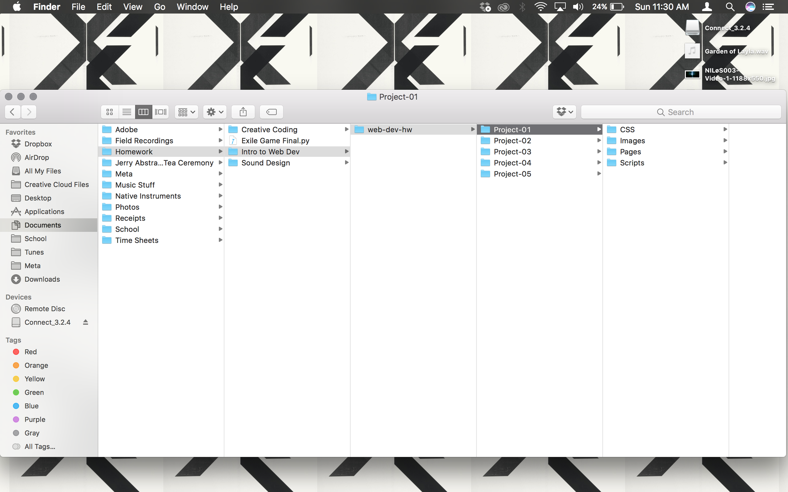
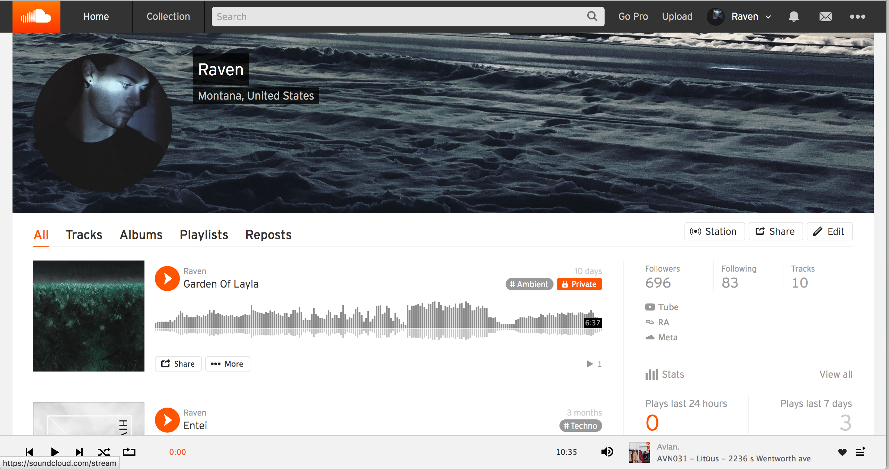
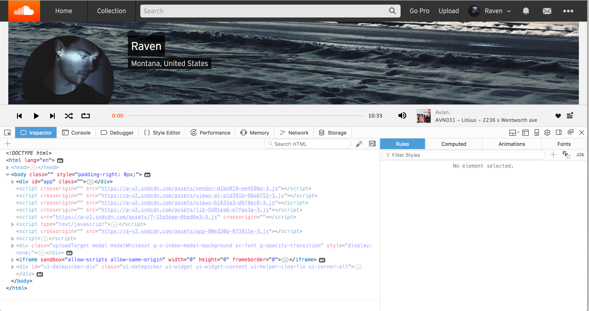
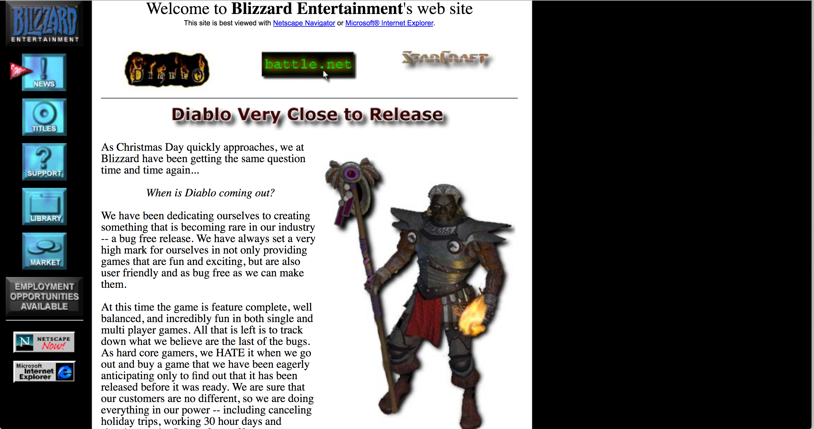
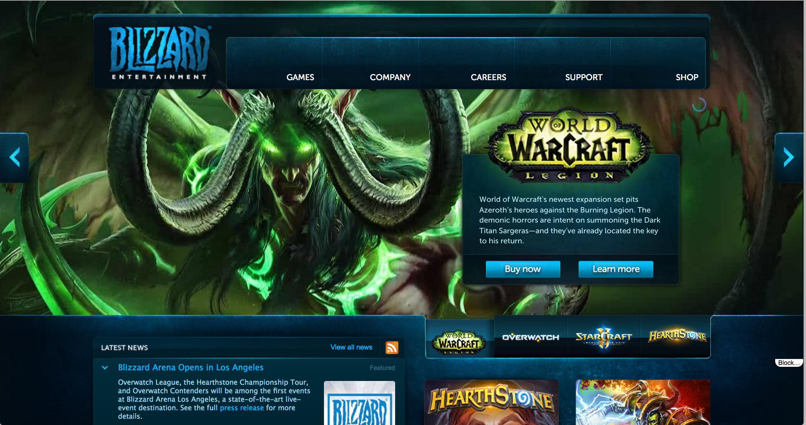
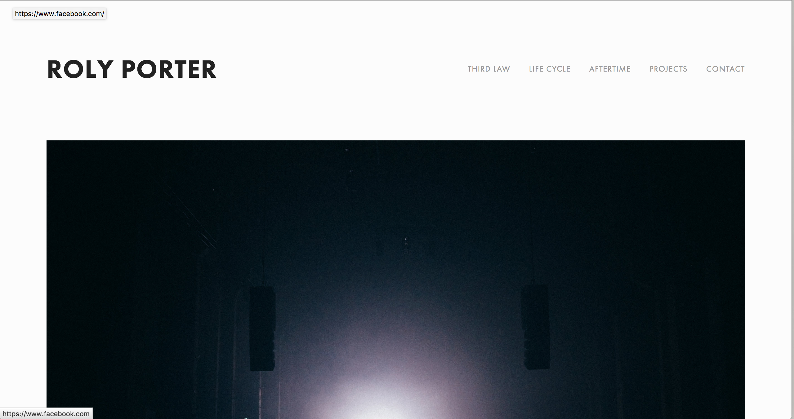
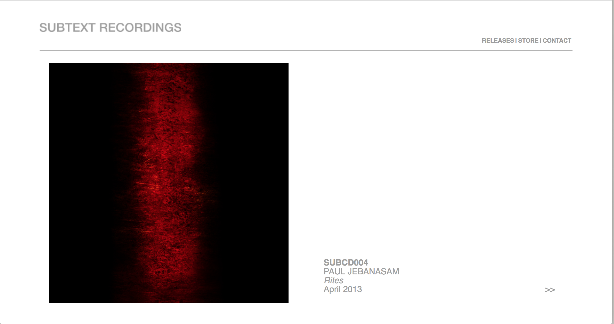

# My First README.md
---
## *Michael Johnson*
---
**My Experience So Far**

*Let me tell you, its not been so bad at all. The hardest part was understanding the layout of github and what was assigned. Other than that, I've been enjoying this assignment and the class. Very excited to learn!*

**The Overwhelming Things**
- Having 2 Coding Classes
- Working Full Time
- *Doing Homework Again In General!*

**Things To Be Excited For**
1. *Michael*, remember you love to learn.
2. Learning to code is already a big interest of mine.
3. I get to make webpages and this class seems so fun!

***

```This must be code block... Anyways, I'm hoping Creative Coding and this class will kind of hold hands somewhat. The class already had me download atom so they are somewhat synced. Either way it should be a great semester!```

*Since we are required to provide a link, here is one to my **[Soundcloud](https://soundcloud.com/ravenmj)**. I create music in the little spare time that I have! :)*

---
#### *Want to see a picture of my family?*
Too bad, check out my directory instead:

---
# 09/11/17
---
## *Observing Webpages*
---
#### Checking into Soundcloud

*Here it is, images, music players, links, etc. Wow look at all those plays!*


*Well, this is surprising. I expected a bit more code on this page, but I guess I have a lot to learn then. Pretty basic, the only things I can really relate to is the basic HTML like the body and html tags. There's lots of scripts which I'm guessing we will eventually learn about.*


---

#### How Old Can We Go?
*Look at this screenshot of blizzard's website from 1996! Reminds me of classic runescape a bit from when I started playing even though that was in the 2000's. I went on and explored the Titles page (which had all their games that had been released up until that point) and Market. It's quite nostalgic to see things look this bad.*


*Here is Blizzard's website today. Quite fancier, and even the picture in the background moves while staying on the page. The webpage obviously looks much better, but still has the easy accesibility like the old one.*


---

#### Here's a Favorite Artist

*Roly Porter is one of my favorite musicians right now. I don't have a particular contemporary artist that I follow, not sure if I even know any. When I see the word artist I think of music first.*

*His webpage is quite simple but looks modern. High quality images and links with specific alignment. Also includes appropriate information for contact and descriptions of albums. If I had to guess we will be able to make something similar to this by the end of the semester.*


*This image is from 2013, apparently, Roly Porter.com was a link to the record label Subtext that which he runs. Interesting! The design of the record label's website is exactly the same today. Both are quite simple but effective. Like before, the website focuses on a large image that takes up a good portion of the screen and the rest is just links and information.*


`End Transmission`
