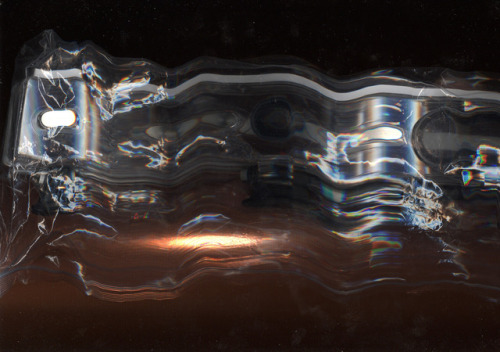
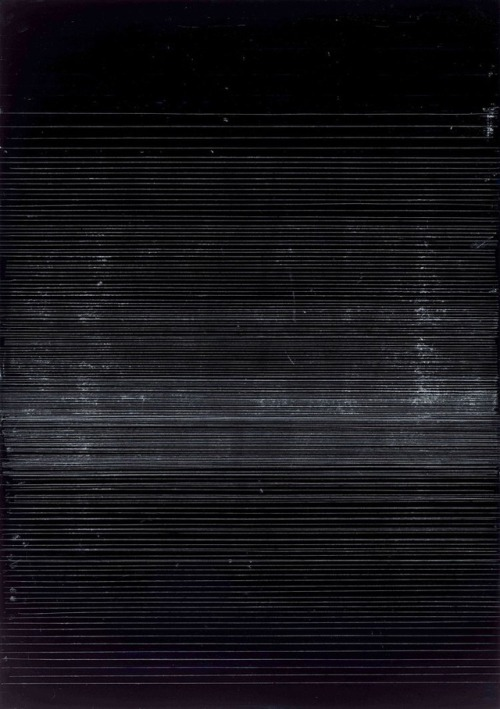
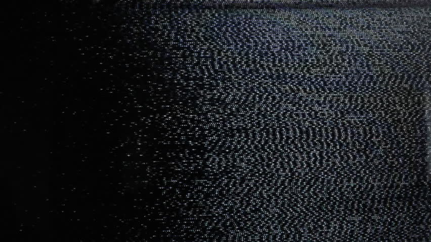
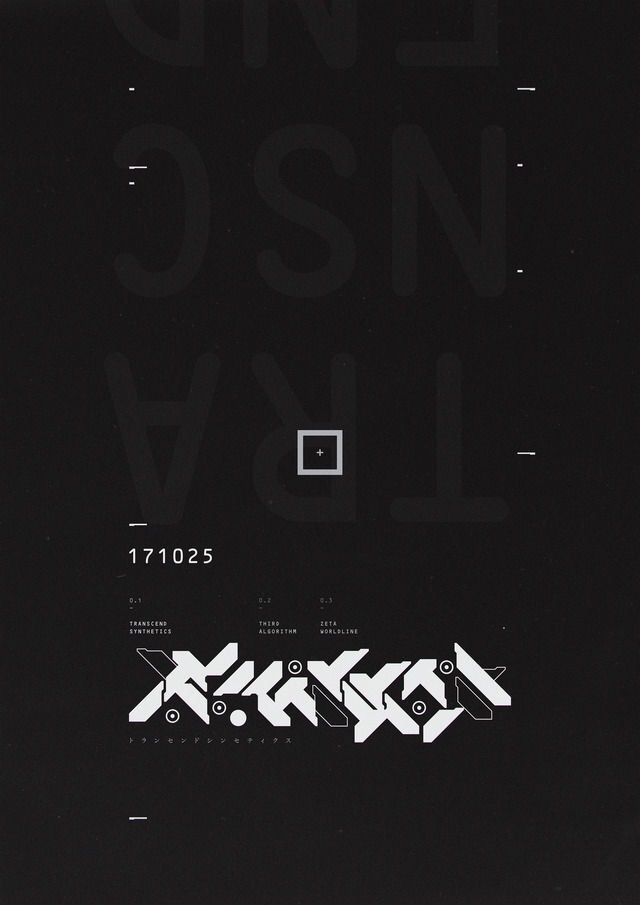
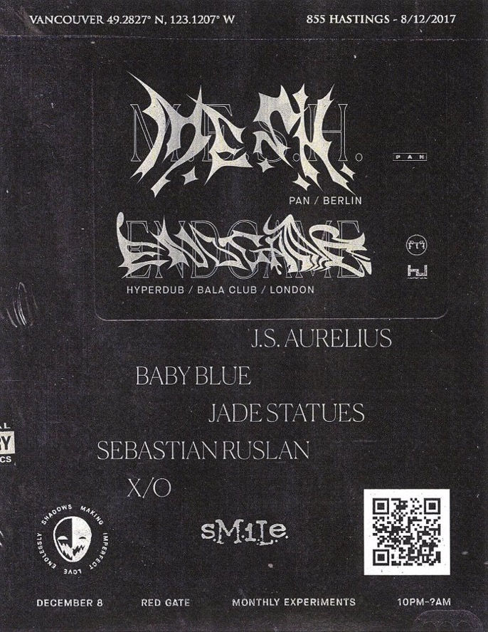

# P R O J E C T _ 0 4

#### *M I C H A E L _ J O H N S O N*

## C O N T E N T

#### The website will be a small profile for some current work I have produced as an electronic musician. With the limited space I will narrow it down to a few things and provide links to the outside web.

#### The content that will be included in my project 04 `index.html` will be the following in chronological order:

- Website title: *Meta*
- Common links to outside sources: *Soundcloud & Twitter*
  - these links are accessed through their logo images
- Image boxes underneath important subjects or links: *textured or light leak or combo*
- Brief description: *Bio and artist statement*
- Break in page: *Image or Design*
- Old Content: *010 and its links*
- Break in page 2: *Image or Design*
- New Content: *New Music works*
- Break in page 3: *Image or Design*
- Contact Info: *Email*

#### Mobile site will be one long scroll with content in chronological order top to bottom.

#### Tablet could maybe be the same with wider images, content boxes, and music boxes.

#### Mac / Pc will have full width. Content will be presented (hopefully) in two columns with images on right, text and links on left.

## A P P E A R E N C E

## The one page website will hopefully encompasses visuals I can only dream of and maybe some illustrative design that will only be there if I can make the time.

## I'm really into light leaks and dark grainy textures. I like to work with these and see if I can make them seem like they have a futuristic story behind them. There may be some photography if I can find something that applies from the past in my library or if I have time to take some new light leaks.

Here are some ideas:

## I'm also really into typography so it would be cool to design the title content from scratch.

Here are some ideas:

