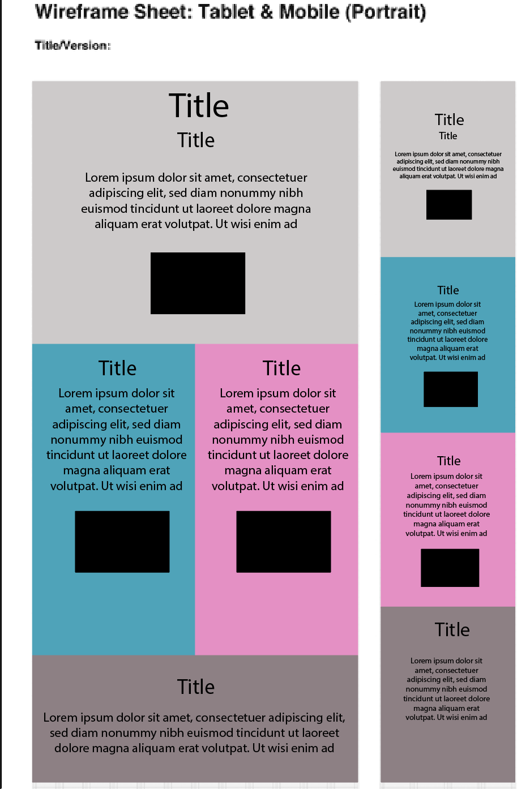

# P R O J E C T _ 0 4

#### *M I C H A E L _ J O H N S O N*

## C O N T E N T

#### The content provided on this small website will be based on:

- What is Responsive Web Design? *This being the Primary content*
- Why is it important? *Secondary*
- What are some tools of RWD? *Secondary*
- Additional links

#### Hopefully the `<h1>` will catch the eye right away and the colors.

#### The content that will be included in my project 04 `index.html` will be the following in chronological order:

It is important to include images that resize with the containers!

Here is what I've been looking at for colors.

#000000
#cdcaca
#4ba3ba
#e68ec5
#808080

My fonts:

*Roboto*
*Work Sans*

## Wireframes

Desktop version will be a larger version of tablet view. Same layout.
