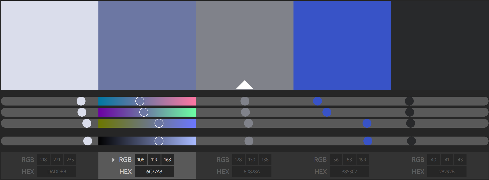

# **Michael Johnson**
## **Project 03** - *The Personal Blog*
---
For **Project 03** i plan to create a website / blog. I want to blog focused thoughts around music and creating music while I'm either in the process of listening and creating.

For example, one page could be thoughts and feelings on recently purchased music and could include photos, links, and information on the artist.

Another page could be the process of me working on a song and ideas that I want to include in it. Almost like a work station to jot ideas down and the results while working on the track or tracks.

One other idea could just be normal things that you find on blogs, like things that are inspirational or a days events with feelings on it. Maybe some photography that was taken recently, or art created.

### **Material**

The material for **Project 03** will come from different sources. If I'm describing a song that I'm listening to, I will get information about the artist from their website and perhaps a link to the song through bandcamp or youtube. The personal music project and the events page would come entirely from me so I would be in charge of creating and uploading that material.

### **About the Author**

What will I say about myself? Well that I am a student, a husband, and an artist at heart. I could have a picture of me and a few little tidbits and hobbies. If it's about another artist I'm listening to I will obviously get their information, photo, and a little bit of bio information.

### **Color Palette**

Here is a color palette that I'm thinking of using.

### **Image Inspiration**

### **Fonts**
[Cinzel Decorative](https://fonts.google.com/specimen/Cinzel+Decorative) from google fonts.

[Geo Sans Light](https://www.dafont.com/geo-sans-light.font) I already own this font and love it so I'll likely use it.

## **Project 03 Update: 11/01/17**

The blog will now be focused around music and art. Besides the required pages there will be a music and visual page. `index.html` will be the home page and will link to other pages. These pages will include information on the project, artist, and the blog's input. The pages will be called `audio.html` and `visual.html`.

The `about.html` page will contain information on the blog. The `contact.html` will have information on contacting the authors. Not exactly sure what the sample page is for... details to add.

## **Project 03 Update: 11/06/17**

Changed a few things in the last few days. The blog will now only consist of music that I've been listening to this year. I will be adding as much info as I can before the final week is over. I also am using the font Roboto from google fonts now instead of cinzel.

As for appearences, I added the color #cd1c41 and rgb(0, 0, 0); to my theme.

My color and font choices are kind of the styles that I am into right now. Almost like futuristic but rooted in a future envisioned a decade or two ago.

Biggest thing I overcame this week is linking my css to my `/pages`, all I had to do was add a `.` to the directory. :)

I would like to work on style more and add images as backgrounds. I feel like my styling would make a little more sense that way.

## **Project 03 Update: 11/15/17**

Updated my css, well actually started a new css and copied over what I was thought was worth keeping. It was actually a lot harder then I thought it would be to renew old code with updated structural appearence. It's going to go a lot better I think when starting from scratch for project 04. Looking forward to that. I don't quite understand all of the content in the 3rd css part but I'm slowly coming along. 
